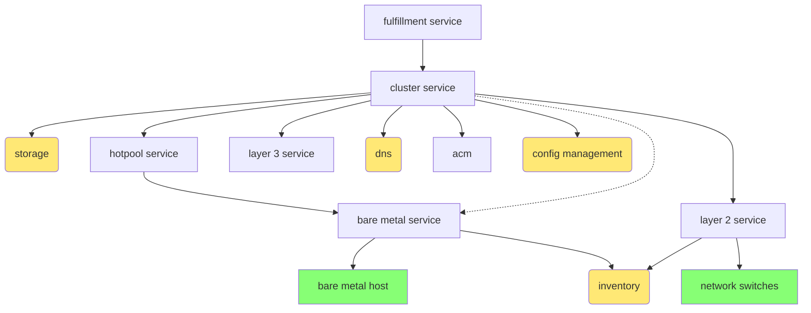

# Fulfillment workflow

> [!WARNING]
> This is a **draft** of the fulfillment workflow.

## Creating a cluster

### Super high level overview

This section has a high level overview of the fulfillment workflow.

I've tried to capture the relationship between the involved components in the following diagram. The yellow boxes represent services that we expect to exist somewhere, but aren't necessarily part of our development work. The green boxes represent aggregate hardware resources.

- Fulfillment service (**FS**) receives a request for a cluster
- FS selects an appropriate backend and delivers request to cluster service (**CS**) on selected cluster
- CS receives request and then...

  - Contacts layer 2 service (**L2S**) to create l2 network and bind agents to network
  - Contacts layer 3 service (**L3S**) to create l3 network (cidr, dhcp, gateway) and allocate floating/elastic ips for api and ingress
  - Contacts storage provider to allocate volume storage for new cluster
  - Contacts dns provider to create resource records for api and ingress
  - Contacts ACM to initiate cluster deployment on selected agents
  - Waits for cluster deployment to complete, then initiate post-install configuration tasks
  - When post-install configuration is complete, initiate validation tasks

- Post install configuration tasks include:
  - Attach cluster to volume storage
  - Create certificates
  - Install operators
  - Configure authn/authz if using provider IDP

- Validation tasks include:
  - Make sure nodes are healthy
  - Make sure operators are healthy
  - Make sure clusterversion is healthy
  - Test functionality of major applications (e.g., RHOAI)

Throughout the process, *FS* polls *CS* (maybe? Or **CS** signals **FS**?) so that progress can be reported via the fulfillment api. Fulfillment api must include operations for listing clusters, getting cluster details -- including admin credentials -- etc.

### Details

#### Fulfillment service (**FS**)

- Receive cluster request via API
- Select backend management cluster
- Send cluster request to cluster service (**CS**) on selected cluster

#### Cluster service (**CS**)

- Receive cluster request from fulfillment service (**FS**)
- Find requested cluster template and map request to resources (number of nodes, specific hardware requirements, etc)
- Select agents (e.g., apply appropriate labels) from free agent pool
  - If there are insufficient free agents, arrange to add additional agents. Block until agents are available.
  - In the design document, we have described a "hotpool service" that is responsible for driving the discovery process for new agents (and ensuring some minimum number of free agents are always available).
  - Hotpool service is responsible for adding new agents by interacting with bare metal service (**BMS**) to drive agent discovery process
  - **BMS** uses inventory to discovery available hardware
- Send request to layer 2 service (**L2S**) to create a new l2 network.
  - **L2S** selects a VLAN ID from available pool.
- Send a request to **L2S** to bind selected agents to new network.
  - **L2S** locates switch ports associated with selected agents and updates switch configuration.
  - **L2S** uses inventory service to discover switches, ports, etc.
- Wait for agent metadata (discovered ip addresses) to update.
- Send a request to layer 3 service (**L3S**) to create a new l3 network.
  - **L3S** schedules dhcp service on management cluster
  - **L3S** schedules network gateway on management cluster
- Bind l3 network to l2 network
  - Ultimately involves connecting VLAN to management cluster (L2S) and plumbing an appropriate interface into l3 network pods.
- Send a request to **L3S** to allocate new floating ips for ingress and api addresses
  - Need to configure NAT or LB to handle floating ip/internal ip translation.
- Send a request to **DNS** to create resource records for ingress and api addresses
- Send a request to storage provider to allocate volume storage for the cluster
- Send a request to ACM to initiate cluster deployment.
  - Use an `agentLabelSelector` to match agents selected earlier by **CS**.
- Poll `HostedCluster` resource until install is complete.
- When cluster is available, initiate post-install configuration
  - This could be ACM policies, or an EDA workflow, or some combination of the two
  - We've talked about a gitops workflow:
    1. Generate configuration manifests from templates
    2. Push to git repository
    3. Use ACM or ArgoCD to deploy manifests from repository
- When post-install configuration is complete, initiate validation tasks
  - We want to verify that the cluster is healthy before reporting completion
  - Could be another EDA workflow, or just deploy a test workload on the target cluster, or ???
